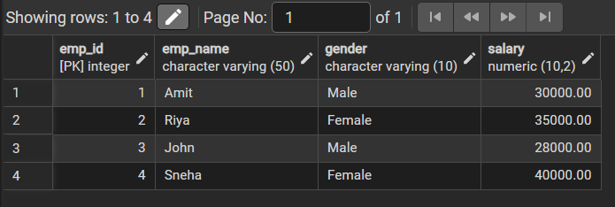
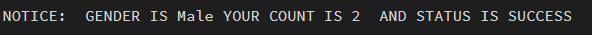

# Experiment 8 – Stored Procedure for Employee Count by Gender (PostgreSQL)

## Experiment
**Experiment 8:** Designing and implementing a stored procedure to calculate the number of employees based on gender using PostgreSQL. This experiment demonstrates procedural programming, parameter handling (IN, OUT, INOUT), and execution of stored procedures in a database environment.

---

## Aim
To design and implement a stored procedure that calculates the number of employees based on gender and returns the result along with execution status.

---

## Objective
- To create a table and insert employee data.  
- To design a stored procedure using PL/pgSQL.  
- To understand the use of **IN, OUT, and INOUT parameters**.  
- To execute and test stored procedures using anonymous blocks.  
- To display results using `RAISE NOTICE`.  

---

## Software Requirements

### Database Management System:
- PostgreSQL  

### Database Administration Tool / Client Tool:
- pgAdmin  

---

## Problem Statement
In database systems, reusable logic is often required to perform repeated operations efficiently. Counting employees based on gender is a common requirement in HR systems. Instead of writing queries repeatedly, a stored procedure can be used to encapsulate this logic and improve maintainability and reusability.

---

## Practical / Experiment Steps
1. Create an `employees` table with relevant attributes.  
2. Insert sample employee data into the table.  
3. Write a stored procedure to count employees based on gender.  
4. Use **IN parameter** to pass gender.  
5. Use **OUT parameter** to return employee count.  
6. Use **INOUT parameter** to return execution status.  
7. Execute the procedure using a DO block.  
8. Display output using `RAISE NOTICE`.  

---

## Procedure
1. Open pgAdmin and connect to the PostgreSQL database.  
2. Create the `employees` table with columns: emp_id, emp_name, gender, salary.  
3. Insert sample data into the table.  
4. Verify data using a `SELECT` query.  
5. Create a stored procedure using PL/pgSQL.  
6. Define parameters:  
   - IN → Gender input  
   - OUT → Employee count  
   - INOUT → Status message  
7. Execute the procedure using an anonymous DO block.  
8. Display results using `RAISE NOTICE`.  

---

## Input / Output Details

### Input
**Table:** employees  
- emp_id (Primary Key)  
- emp_name  
- gender  
- salary  

**Procedure Parameters:**  
- Input: Gender (e.g., 'Male', 'Female')  
- Output: Employee Count  
- InOut: Status message  

---

## Output
- Created Table
  

- Actual Output
  

---

## Learning Outcome
After completing this experiment, the learner will be able to:  
- Understand the concept of stored procedures in PostgreSQL.  
- Use IN, OUT, and INOUT parameters effectively.  
- Implement reusable database logic using PL/pgSQL.  
- Execute stored procedures using anonymous blocks.  
- Display results using `RAISE NOTICE`.  
- Apply stored procedures in real-world applications such as HR systems and reporting modules.  
